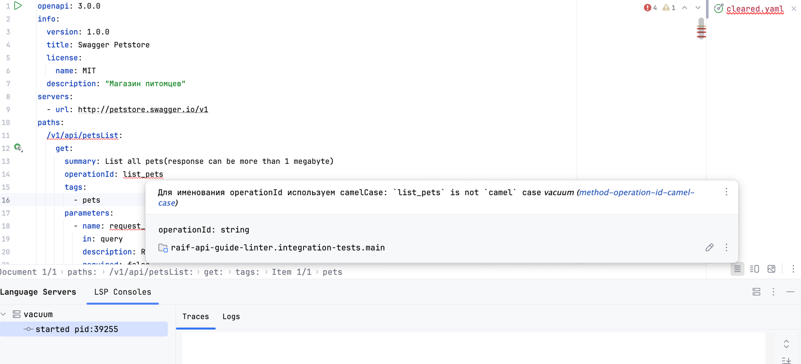
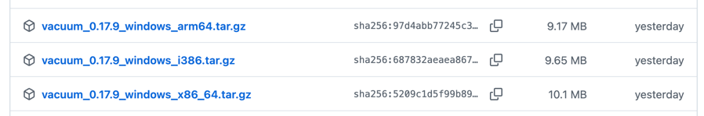
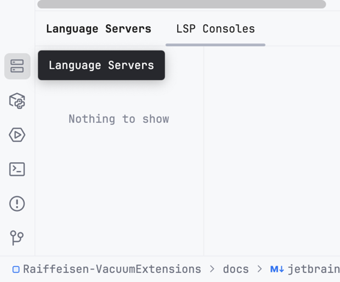
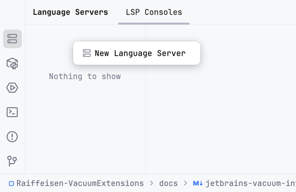
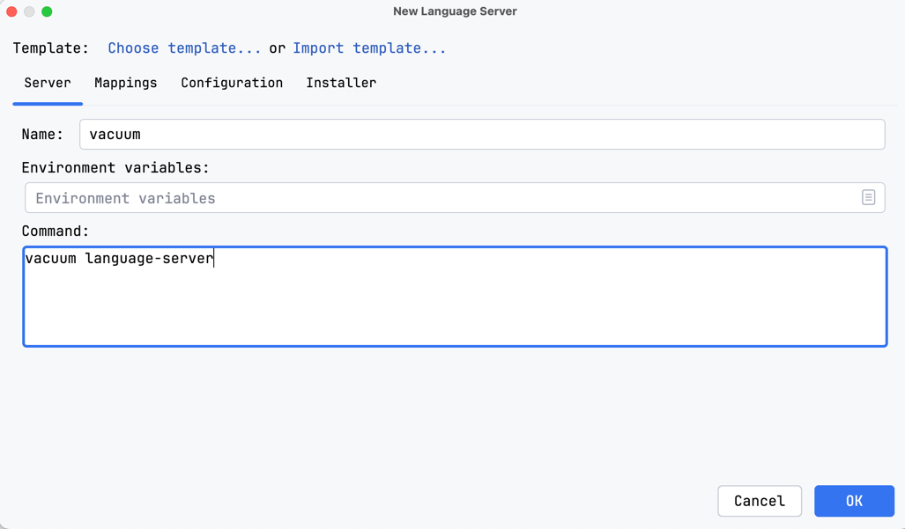
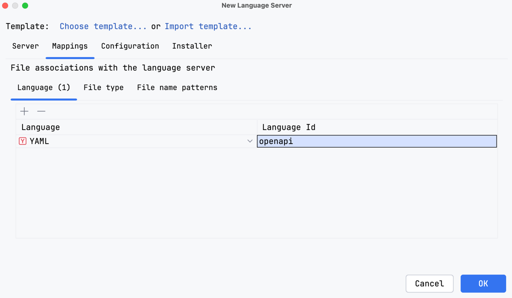
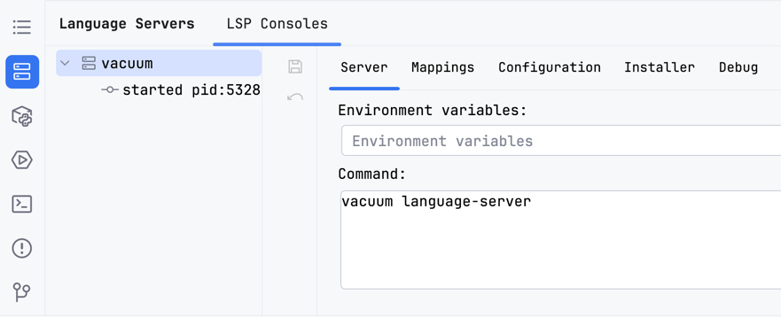
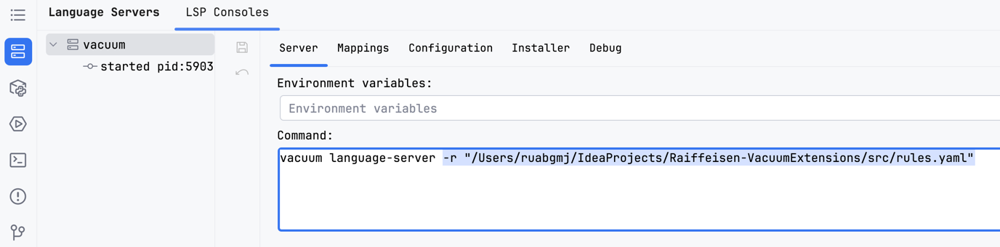
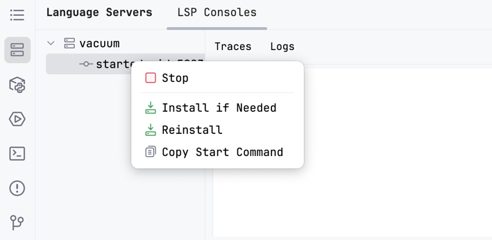
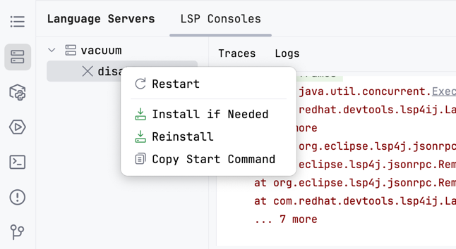

# Подключение Vacuum в IDE от JetBrains

## Введение

[Vacuum](https://quobix.com/vacuum/) - линтер для openapi файлов.
Он работает через командную строку.
Однако в нем есть поддержка [language server](https://microsoft.github.io/language-server-protocol/)
(абстракция над IDE).
Для jetbrains IDE есть реализация language server protocol в виде плагина
[lsp4ij](https://plugins.jetbrains.com/plugin/23257-lsp4ij).
Подключив этот плагин и настроив в нем Vacuum можно будет интерактивно следить за ошибками



## Установка

1. Установите плагин lsp4ij - https://plugins.jetbrains.com/plugin/23257-lsp4ij.
   Это можно сделать либо по указанной ссылке, либо в IDE перейти
   `Settings -> Plugins -> Выбрать сверху Marketplace -> ввести lsp4ij -> скачать плагин`
2. Установите vacuum:
   - Если у вас macos, linux или windows c npm, то используйте [инструкцию](https://quobix.com/vacuum/installing/)
   - Если у вас windows без npm:
     - Зайдите на [страницу релизов](https://github.com/daveshanley/vacuum/releases)
     - Выберите tar.gz под ваш компьютер
       
     - Нажмите на него, чтобы скачать
     - Разархивируйте его(можете использовать для этого https://extract.me/ru/ или погуглите как разархивировать tar.gz)
     - Вы получите файл `vacuum.exe`
     - Необходимо добавить его в PATH - [инструкция](https://remontka.pro/add-to-path-variable-windows/)
     - Можете проверить, что все получилось написав в командной строке или в powershell команду `vacuum`
3. Добавьте vacuum как lsp сервер:
   - Откройте свою IDE от JetBrains 
   - Найдите иконку language servers(должна быть в левом нижнем углу)
   
   - Нажмите ПКМ по области с надписью `Nothing to show`
   
   - Нажмите на `New Language Server`
   - В открывшемся окне введите любое имя, в поле command введите `vacuum language-server`
   
   - Перейдите в окно `Mapping`, выберите Language - yaml, в Language Id введите openapi, нажмите OK
   
   - Теперь vacuum будет работать на одиночных файлах со встроенными правилами
   

## Использование правил от Райфа

У Райффайзен банка есть [гайд](https://github.com/Raiffeisen-DGTL/rest-api-guide) по оформлению openapi.
Я реализовал некоторые правила оттуда в формате [spectral](https://stoplight.io/open-source/spectral).
Реализация находится в файле [src/raif-rules.yaml](../src/raif-rules.yaml).
Чтобы подключить эти правила в vacuum необходимо 
- Скачать файл [src/rules.yaml](../src/rules.yaml).
  Рекомендую положить его в домашнюю папку(но это не обязательно).
- Если вы хотите полностью отменить встроенные правила vacuum закомментируйте строку с ними
  ```yaml
  extends:
    # Встроенные правила vacuum
    # - [vacuum:oas, recommended]
    # Правила Райфа
    - https://raw.githubusercontent.com/Marat-Tim/Raiffeisen-VacuumExtensions/main/src/raif-rules.yaml
  ```
- Скопируйте путь к получившемуся файлу(для простоты используйте абсолютный путь)
- Откройте в IDE ваш lsp сервер
  
- Добавьте в раздел Command параметр `-r "Путь до файла"`
  
- [Перезапустите lsp](#Решение-проблем)
- Теперь у вас используются правила Райфа(для работы необходим доступ в интернет)

## Работа с openapi, разделенным на несколько файлов

На данный момент я не знаю как это сделать.
Автор vacuum говорит, что [это возможно](https://github.com/daveshanley/vacuum/issues/686#issuecomment-3152437733).
Однако у меня это [не работает и я завел issue](https://github.com/daveshanley/vacuum/issues/695).
Вы можете написать что-то в нем, чтобы проблема решилась быстрее

## Решение проблем

Если вы столкнулись с любой ошибкой, то напишите, пожалуйста о ней в
https://github.com/Marat-Tim/Raiffeisen-VacuumExtensions/issues/new

Часто может помочь перезапуск lsp. Для этого:
- Откройте в IDE ваш lsp сервер
- Нажмите ПКМ по надписи `started pid:...`
  
- Нажмите Stop(не обращайте внимания на красный текст в логах)
- Нажмите ПКМ по надписи `disabled`

  
- Кликните на Restart

## Послесловие

Я могу сделать готовый плагин, который будет выполнять все указанные выше пункты автоматически.
Однако я не уверен, что в этом есть потребность.
Если вам нужен такой плагин напишите [здесь](https://github.com/Marat-Tim/Raiffeisen-VacuumExtensions/issues/1)

Возможно это все можно сделать с помощью
[плагина spectral для JetBrains](https://plugins.jetbrains.com/plugin/18520-spectral).
Но spectral устарел и уже особо не поддерживается, поэтому мне не хочется
с ним связываться

С переходом Intellij IDEA на [Unified Distribution](https://blog.jetbrains.com/idea/2025/07/intellij-idea-unified-distribution-plan/)
открывается доступ к [реализации lsp от JetBrains](https://platform.jetbrains.com/t/lsp-api-available-in-intellij-idea-ultimate-2025-2-without-paid-subscription/2284).
Я пока не изучал, но это может упростить интеграцию vacuum

Сейчас я разрабатываю [линтер openapi на основе llm](https://github.com/Marat-Tim/Raiffeisen-ApiGuideLinterUsingLlm).
В нем уже есть документация и частично работающая реализация.
Можете писать свои идеи по доработкам или хорошие промпты в [issues](https://github.com/Marat-Tim/Raiffeisen-ApiGuideLinterUsingLlm/issues/new)
