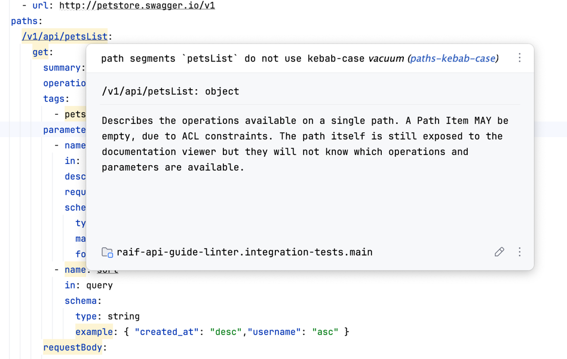

# Подключение Vacuum в IDE от JetBrains

## Введение

[Vacuum](https://quobix.com/vacuum/) - линтер для openapi файлов.
Он работает через командную строку.
Однако в нем есть поддержка [language server](https://microsoft.github.io/language-server-protocol/)
(абстракция над IDE).
Для jetbrains IDE есть реализация language server protocol в виде плагина
[lsp4ij](https://plugins.jetbrains.com/plugin/23257-lsp4ij).
Подключив этот плагин и настроив в нем Vacuum можно будет интерактивно следить за ошибками

## Установка

1. Установите плагин lsp4ij - https://plugins.jetbrains.com/plugin/23257-lsp4ij.
   Это можно сделать либо по указанной ссылке, либо в IDE перейти
   `Settings -> Plugins -> Выбрать сверху Marketplace -> ввести lsp4ij -> скачать плагин`
2. Установите vacuum:
   - Если у вас macos, linux или windows c npm, то используйте [инструкцию](https://quobix.com/vacuum/installing/)
   - Если у вас windows без npm:
     - Зайдите на [страницу релизов](https://github.com/daveshanley/vacuum/releases)
     - Выберите tar.gz под ваш компьютер
       
     - Нажмите на него, чтобы скачать
     - Разархивируйте его(можете использовать для этого https://extract.me/ru/ или погуглите как разархивировать tar.gz)
     - Вы получите файл `vacuum.exe`
     - Необходимо добавить его в PATH - [инструкция](https://remontka.pro/add-to-path-variable-windows/)
     - Можете проверить, что все получилось написав в командной строке или в powershell команду `vacuum`
3. Добавьте vacuum как lsp сервер:
   - Откройте свою IDE от JetBrains 
   - Найдите иконку language servers(должна быть в левом нижнем углу)
   
   - Нажмите ПКМ по области с надписью `Nothing to show`
   
   - Нажмите на `New Language Server`
   - В открывшемся окне введите любое имя, в поле command введите `vacuum language-server`
   
   - Перейдите в окно `Mapping`, выберите Language - yaml, в Language Id введите openapi, нажмите OK
   
   - Теперь vacuum будет работать на одиночных файлах со встроенными правилами
   
